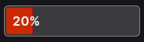
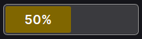
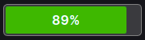

# Bar Display Extension
This Foxglove extension provides a customizable bar display for visualizing scalar values from any topic. Users can configure min/max reference values and custom colors for the bar visualization.





## Features
* **Universal Topic Support**: Works with any topic containing scalar numeric values
* **Configurable Range**: Set custom min/max values for percentage calculation
* **Custom Colors**: Use hex color codes to style the bar
* **Smart Value Extraction**: Automatically finds numeric values in message fields (value, data, x, y, z, position, velocity, temperature, pressure, etc.)
* **Dual Display**: Shows both the actual scalar value and percentage fill
* **Smooth Animations**: Bar transitions with smooth visual effects

## Configuration Options
* **Topic**: Select any available topic from the dropdown
* **Min Value**: Set the minimum reference value for 0% fill
* **Max Value**: Set the maximum reference value for 100% fill  
* **Bar Color**: Enter a hex color code (e.g., #00ff00, #ff0000) for the bar color

---

The indicator is available as a React component for integration in other panels.


## Install
To install the extension, download the `.foxe` file present in the latest release. Open it with Foxglove Studio and it will be installed as a local extension.

## _A Foxglove Studio Extension_

[Foxglove Studio](https://github.com/foxglove/studio) allows developers to create extensions, or custom code that is loaded and executed inside the Foxglove Studio application. This can be used to add custom panels. Extensions are authored in TypeScript using the `@foxglove/studio` SDK.

### Develop

Extension development uses the `npm` package manager to install development dependencies and run build scripts.

To install extension dependencies, run `npm` from the root of the extension package.

```sh
npm install
```

To build and install the extension into your local Foxglove Studio desktop app, run:

```sh
npm run local-install
```

Open the `Foxglove Studio` desktop (or `ctrl-R` to refresh if it is already open). Your extension is installed and available within the app.

### Package

Extensions are packaged into `.foxe` files. These files contain the metadata (package.json) and the build code for the extension.

Before packaging, make sure to set `name`, `publisher`, `version`, and `description` fields in _package.json_. When ready to distribute the extension, run:

```sh
npm run package
```

This command will package the extension into a `.foxe` file in the local directory.

### Publish

You can publish the extension for the public marketplace or privately for your organization.

See documentation here: https://foxglove.dev/docs/studio/extensions/publish#packaging-your-extension
