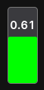
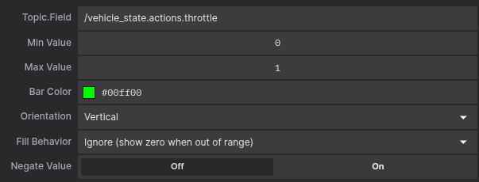

# Bar Display Extension
This Foxglove extension provides a highly customizable bar display for visualizing scalar values from any topic with configurable ranges, colors, orientations, and advanced fill behaviors.






## Features
* **Universal Topic Support**: Works with any topic containing scalar numeric values
* **Smart Field Detection**: Automatically discovers numeric fields in custom message formats and nested structures
* **Autocomplete Topic Selection**: Dropdown with real-time suggestions for topic.field combinations
* **Dual Orientation**: Horizontal and vertical bar orientations with proper panel resizing
* **Advanced Fill Behaviors**: 
  - **Clamp**: Shows min/max fill when values are out of range
  - **Ignore**: Shows zero fill and hides value when out of range
* **Value Processing**: Optional negation to invert input values
* **Visual Color Picker**: Standard Foxglove color picker with hex color support
* **Real-time Response**: No animation lag for fast oscillating data
* **Nested Field Support**: Handles deeply nested fields (e.g., `pose.position.x`, `sensor.readings.temperature`)

## Configuration Options
* **Topic.Field**: Autocomplete input for selecting topic and field combinations
* **Min Value**: Minimum reference value for 0% fill calculation
* **Max Value**: Maximum reference value for 100% fill calculation
* **Bar Color**: Visual color picker with hex color code support
* **Orientation**: Choose between horizontal or vertical bar display
* **Fill Behavior**: Select clamp or ignore behavior for out-of-range values
* **Negate Value**: Toggle to invert input values (multiply by -1)

---

The indicator is available as a React component for integration in other panels.


## Install
To install the extension, download the `.foxe` file present in the latest release. Open it with Foxglove Studio and it will be installed as a local extension.

## _A Foxglove Studio Extension_

[Foxglove Studio](https://github.com/foxglove/studio) allows developers to create extensions, or custom code that is loaded and executed inside the Foxglove Studio application. This can be used to add custom panels. Extensions are authored in TypeScript using the `@foxglove/studio` SDK.

### Develop

Extension development uses the `npm` package manager to install development dependencies and run build scripts.

To install extension dependencies, run `npm` from the root of the extension package.

```sh
npm install
```

To build and install the extension into your local Foxglove Studio desktop app, run:

```sh
npm run local-install
```

Open the `Foxglove Studio` desktop (or `ctrl-R` to refresh if it is already open). Your extension is installed and available within the app.

### Package

Extensions are packaged into `.foxe` files. These files contain the metadata (package.json) and the build code for the extension.

Before packaging, make sure to set `name`, `publisher`, `version`, and `description` fields in _package.json_. When ready to distribute the extension, run:

```sh
npm run package
```

This command will package the extension into a `.foxe` file in the local directory.

### Publish

You can publish the extension for the public marketplace or privately for your organization.

See documentation here: https://foxglove.dev/docs/studio/extensions/publish#packaging-your-extension
